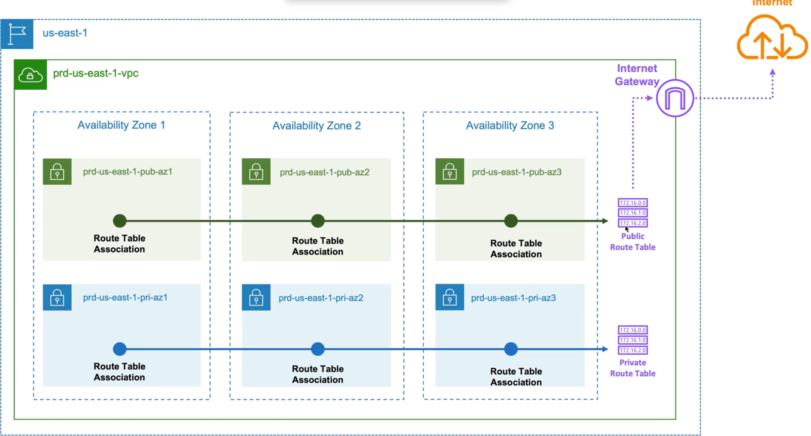

<!-- Slide: Fəsil 4 — bölmə başlığı -->

  

    <svg width="72" height="72" viewBox="0 0 24 24" fill="#7B42BC" xmlns="http://www.w3.org/2000/svg"><path d="M1.44 0v7.575l6.561 3.79V3.787zm21.12 4.227l-6.561 3.791v7.574l6.56-3.787zM8.72 4.23v7.575l6.561 3.787V8.018zm0 8.405v7.575L15.28 24v-7.578z" /></svg>
    
🤝

    
🤖

  

  
Fəsil 4

  
Terraform Development — Copilot İşə Düşür!

  

    

      4.1 Layihəyə sürətli start (scaffold) &nbsp;·&nbsp; 4.2 Copilot ilə ilk konfiqurasiya 
      4.3 Təklifləri genişləndirmək &nbsp;·&nbsp; 4.4 Copilot menyusu &nbsp;·&nbsp; 4.5 Modul yaratmaq
    

  

  
✅ Fəsil 2-nin demo-sunda hər şeyi <b>əl ilə</b> yazdıq və qadağa qoymuşduq. Qadağa bitdi — bu fəsildən <b>Copilot açıqdır</b>. Eyni işləri indi onun sürəti ilə edəcəyik və fərqi özün görəcəksən.

---

<!-- Slide 4.1a: Niyə scaffold -->
## 4.1 — Layihəyə Sürətli Start: Problem və Həll

Fəsil 2-dən bilirik: Terraform layihəsi **bir fayldan ibarət olmur**. Standart layihədə:

my-terraform-project/ 
├── main.tf&nbsp;&nbsp;&nbsp;&nbsp;&nbsp;&nbsp;&nbsp;&nbsp;&nbsp;&nbsp;# əsas konfiqurasiya / modul çağırışları 
├── variables.tf&nbsp;&nbsp;&nbsp;&nbsp;&nbsp;# giriş dəyişənləri 
├── outputs.tf&nbsp;&nbsp;&nbsp;&nbsp;&nbsp;&nbsp;&nbsp;# çıxış dəyərləri 
├── terraform.tfvars&nbsp;# dəyişənlərin real dəyərləri 
├── README.md 
└── modules/ 
&nbsp;&nbsp;&nbsp;&nbsp;└── example-module/ 
&nbsp;&nbsp;&nbsp;&nbsp;&nbsp;&nbsp;&nbsp;&nbsp;├── main.tf 
&nbsp;&nbsp;&nbsp;&nbsp;&nbsp;&nbsp;&nbsp;&nbsp;├── variables.tf 
&nbsp;&nbsp;&nbsp;&nbsp;&nbsp;&nbsp;&nbsp;&nbsp;├── outputs.tf 
&nbsp;&nbsp;&nbsp;&nbsp;&nbsp;&nbsp;&nbsp;&nbsp;└── README.md

<strong>Problem:</strong> hər yeni layihədə bu qovluq və faylları <strong>əl ilə</strong> yaratmaq — darıxdırıcı, təkrarlanan iş. Setup friction.

<strong>Həll:</strong> Copilot Chat-in <strong>scaffold</strong> (skelet) qurma imkanı — bir əmrlə bütün strukturu yaradır.

🤖 Bu bölmədə qəsdən bir az "irəli qaçırıq": Chat-i dərindən Fəsil 5-də öyrənəcəyik. Amma layihəyə sürətli start üçün bu bir fəndi indi götürürük.

---

## 4.1 — Agent Rejimi ilə Skeleti Copilot Qursun

🖥️ <b>Sən də et</b> — boş <code>demo</code> qovluğunu VS Code-da aç və addımları təkrarla:

1<b>Chat panelini aç</b> — ⌃⌘I (Ctrl+Alt+I) və ya yuxarıda Copilot ikonu

2Mesaj qutusunun altını yoxla: sessiya <b>Local</b> olmalıdır ("Copilot CLI" yazırsa → klik → Local seç), rejim: <b>Agent</b>

3Yaz (ingiliscə!):

Create all the files needed for a new Terraform project that includes modules: main.tf, variables.tf, outputs.tf, terraform.tfvars, README, and a modules/example-module folder

4Agent faylları <b>birbaşa yaradır</b> — chat-də "Created 6 files" hesabatını və Explorer-də strukturu gör

5Mesaj qutusunun üstündə <b>Keep</b> bas — dəyişikliklər təsdiqlənir (<b>Undo</b> = hamısı geri qayıdır!)

<strong>Niyə Agent rejimi?</strong>

<ul>
<li>Fayl siyahısını <strong>dəqiq sadalayırıq</strong> — nəticə proqnozlaşdırıla bilir</li>
<li>Agent yaradır, amma <strong>son söz səndədir</strong>: Keep / Undo</li>
<li>Fayllar harada yarandığını chat hesabatında yoxla</li>
</ul>

⚠️ Yaranan fayllarda <b>nümunə kodlar</b> ola bilər — bizə lazım olan <b>strukturdur</b>, nümunələri silmək olar. Copilot probabilistikdir: modul qovluğu natamam çıxsa, davam yaz: <em>"Add variables.tf and outputs.tf to the module folder"</em>.

🤖 Köhnə materiallarda bu iş üçün <code>@workspace /new</code> əmri göstərilir — <b>yeni VS Code-da işləmir</b> ("Unexpected generated prompt structure" xətası). Rast gəlsən, bil ki, Agent rejimi onun müasir əvəzidir.

---

<!-- Slide 4.1c: Nəticə və vərdiş -->
## 4.1 — Nəticə: Bir Prompt = Hazır Layihə

  

    
💬 1 chat mesajı

    
Agent rejimi + fayl siyahılı təsvir

  

  
→

  

    
👀 Baxış + təsdiq

    
hesabatı oxu → Keep (və ya Undo)

  

  
→

  

    
📁 10 fayl, 3 qovluq

    
standart Terraform layihəsi

  

- Bu strukturu **kursun sonuna qədər** istifadə edəcəyik — bütün lab-lar bu qəlibdə gedir
- **Yaxşı işləyən promptu saxla!** Bir dəfə tapdın → hər yeni layihədə eyni promptu işlət — öz &quot;layihə şablonun&quot; olur

❓ Free planda 50 chat mesajı var. Bu əməliyyat neçəsini yedi?

💡 Cəmi <b>1 mesaj</b> — 10 faylın hamısı bir cavabda gəldi. Chat-i belə "toplu" işlər üçün işlətmək limitə qənaətdir; sətir-sətir kod üçün isə completions var (limiti ayrıdır: 2000/ay).

✅ Yadda saxla: faylları Copilot yaratdı, təsdiqi <b>sən verdin</b> (Keep düyməsi). Bu, kursun ana xəttinin chat versiyasıdır: AI icra edir — qərar səndədir.

➡️ Növbəti: <b>4.2 — Copilot ilə ilk Terraform konfiqurasiyası</b> — bu skeletin içini əsl infrastruktur kodu ilə dolduracağıq.

---

<!-- Slide 4.2a1: Anlayışlar lüğəti -->
## 4.2 — Əvvəlcə Anlayışlar: Nədən Danışırıq?

Memarlığa keçməzdən əvvəl hər komponenti tanıyaq — **analogiya: AWS = ölkə, sənin infrastrukturun = orada tikdiyin obyektlər:**

  

    
🌍 Region

    
AWS-in <b>coğrafi mərkəzi</b> — data mərkəzlərinin yerləşdiyi ərazi. Bizimki: <code>eu-north-1</code> (Stokholm). <em>Analogiya: şəhər.</em>

  

  

    
🏢 Availability Zone (AZ)

    
Region daxilində <b>müstəqil data mərkəzi</b> — ayrı elektrik, ayrı şəbəkə. Biri çöksə, digərləri işləyir → yükü 3 AZ-yə yayırıq. <em>Analogiya: şəhərin fərqli rayonlarındakı filiallar.</em>

  

  

    
🔒 VPC

    
Virtual Private Cloud — cloud-da <b>sənin izolə olunmuş şəxsi şəbəkən</b>, öz IP diapazonu ilə (10.0.0.0/16 = ~65 min ünvan). <em>Analogiya: hasarlanmış ərazi.</em>

  

  

    
▦ Subnet

    
VPC-nin <b>kiçik parçası</b>, konkret bir AZ-də yaşayır (10.0.0.0/24 = 256 ünvan). <b>Public</b> = internetə açıq · <b>Private</b> = yalnız daxili. <em>Analogiya: ərazidəki ayrı-ayrı binalar.</em>

  

  

    
🚪 Internet Gateway (IGW)

    
VPC-nin <b>internetə çıxış qapısı</b> — onsuz şəbəkən dünyadan tam təcriddədir. VPC-yə bir dənə qoşulur. <em>Analogiya: ərazinin əsas darvazası.</em>

  

  

    
🗺️ Route Table + Association

    
<b>Route table</b> — trafikin yol xəritəsi: "bu ünvana gedən paket hara yönəlsin?" <b>Association</b> — xəritəni subnetə <b>bağlayan qoşqu</b>: "sən məhz bu xəritə ilə gedəcəksən." <em>Növbəti slaydda ayrıca izah ↓</em>

  

❓ Public subnet-i public edən nədir?

💡 Subnetin özündə "public" düyməsi yoxdur! Onu public edən — bağlı olduğu <b>route table-da IGW-yə marşrutun olmasıdır</b> (0.0.0.0/0 → IGW). Marşrut yoxdursa → private. Yəni fərqi <b>yol xəritəsi</b> yaradır.

---

## 4.2 — Bəs CIDR Özü Nədir? — &quot;/16&quot;, &quot;/24&quot; Sirri

Hər tərəfdə görürük: `10.0.0.0/16`, `10.0.1.0/24`… Açaq görək bu yazılış nə deyir:

<strong>IP ünvanı</strong> = 4 ədəd rəqəm (hərəsi 0–255): <code>10.0.1.25</code>

<strong>CIDR yazılışı</strong> = ünvan + <code>/N</code>:

10.0.0.0/16

yaşıl = SABİT hissə (şəbəkənin "soyadı") sarı = DƏYİŞƏN hissə (üzvlərin "adları") /16 = ilk 16 bit (= ilk 2 rəqəm) sabitdir

✅ Analogiya: CIDR = <b>küçə ünvanı</b>. <code>/16</code> — "Nizami küçəsi" (bütün evlər ora aiddir), <code>/24</code> — "Nizami küçəsi, 5-ci bina" (yalnız o binadakı mənzillər), <code>/32</code> — konkret bir mənzil.

<table>
<thead>
<tr>
<th>CIDR</th>
<th>Sabit</th>
<th>Əhatə</th>
<th>Ünvan sayı</th>
</tr>
</thead>
<tbody>
<tr>
<td><code>10.0.0.0/16</code></td>
<td>10.0</td>
<td>10.0.<b>0-255</b>.<b>0-255</b></td>
<td>~65.000</td>
</tr>
<tr>
<td><code>10.0.1.0/24</code></td>
<td>10.0.1</td>
<td>10.0.1.<b>0-255</b></td>
<td>256</td>
</tr>
<tr>
<td><code>10.0.1.25/32</code></td>
<td>hamısı</td>
<td>tək ünvan</td>
<td>1</td>
</tr>
<tr>
<td><code>0.0.0.0/0</code></td>
<td>heç nə</td>
<td><b>bütün internet</b></td>
<td>hamısı</td>
</tr>
</tbody>
</table>

Qayda sadədir: <b>/N böyüdükcə şəbəkə kiçilir</b>. Hər +8 (bir rəqəm sabitləşir) = 256 dəfə kiçilmə.

❓ İndi öz kodumuz oxunur: niyə VPC /16, subnet /24?

💡 VPC = böyük küçə (~65 min ünvan) → subnetlər = küçədəki binalar (hərəsi 256 ünvanlıq /24 parça: 10.0.1.0/24, 10.0.2.0/24…). Subnet mütləq VPC küçəsinin <b>içində</b> olmalıdır — 10.1.x.x yazsan, "başqa küçənin binası"dır → apply xətası (özün gördün!). Və route table-dakı <code>0.0.0.0/0</code> = "qalan bütün dünya" — ona görə internetə yol deməkdir.

---

<!-- Slide 4.2a1b: Route Table Association dərindən -->
## 4.2 — Route Table Association: Xəritə və Qoşqu

Üç ayrı anlayışı qarışdırmayaq — **marşrut** (yol qaydası), **route table** (qaydalar toplusu) və **association** (toplunun subnetə bağlanması):

1 · Marşrut (route)

Tək bir yol qaydası: <code>0.0.0.0/0 → IGW</code> <em>"hara gedirsənsə get — qapıdan çıx"</em>

→

2 · Route Table

Marşrutların <b>toplusu</b> — hazır yol xəritəsi. Öz-özünə heç nə etmir: <b>hansısa subnetə bağlanana qədər boş kağızdır</b>.

→

3 · Association

Xəritəni subnetə <b>bağlayan qoşqu</b>: "prd-pub-subnet-1, sən <b>bu</b> xəritə ilə işləyəcəksən." Hər subnet yalnız <b>bir</b> xəritəyə bağlana bilər.

🏙️ Analogiya — naviqator

Route table = <b>naviqator proqramı</b> (yolları bilir) &nbsp;·&nbsp; Subnet = <b>sürücü</b> &nbsp;·&nbsp; Association = <b>telefonu sürücünün maşınına bərkitmək</b>. 
Naviqator nə qədər ağıllı olsa da, maşına qoşulmayıbsa sürücüyə xeyri yoxdur. Bir maşında bir naviqator olur — amma <b>eyni naviqatoru</b> yüzlərlə maşına quraşdırmaq olar (bizdə: 1 public RT → 3 subnet).

<pre is="marp-pre" data-auto-scaling="downscale-only"><code class="language-hcl">resource &quot;aws_route_table_association&quot; &quot;prd-pub-rt-assoc-1&quot; {
  subnet_id      = aws_subnet.prd-pub-subnet-1.id
  route_table_id = aws_route_table.prd-pub-rt.id
}
</code></pre>

✅ Koddakı görünüşü: association resursu cəmi <b>iki arqumentdir</b> — "hansı subnet" + "hansı xəritə". Bütün işi bu cütlük görür. Bizim layihədə 6 subnet var → <b>6 association</b> yazacağıq (3 public + 3 private).

❓ Subnetə heç bir association yazmasaq nə olar?

💡 Sahibsiz qalmır — AWS onu avtomatik VPC-nin <b>main route table</b>-ına bağlayır. Amma bu, gizli davranışdır: hansı xəritə ilə işlədiyi koddan görünmür. Yaxşı praktika: <b>hər subnetə açıq association yaz</b> — biz də belə edirik.

---

<!-- Slide 4.2a2: Memarlıq diaqramı -->
## 4.2 — Memarlıq: Nə Qururuq?

✅ Oxunuşu: hər AZ-də 1 public + 1 private subnet → <b>yaşıl xətt</b> public association-ları Public RT-yə, <b>mavi xətt</b> private-ları Private RT-yə bağlayır → Public RT-dən IGW ⋯▸ internet. Cəmi: <b>16 resurs, 0 ₼</b>.

⚠️ <b>NAT Gateway qəsdən yoxdur</b> — pulludur! Prod-da hər AZ-də olardı ki, private yüklər də internetə çıxa bilsin.

🤖 Diaqramdakı adlar nümunədir (<code>us-east-1</code>) — bizim lab-da: region <b>eu-north-1</b>, adlar <code>prd-vpc</code> / <code>prd-pub-subnet-1..3</code> / <code>prd-pri-subnet-1..3</code>, CIDR 10.0.x.0/24.

---

## 4.2 — provider.tf və Qəbul Etmə Üsulları

Scaffold `providers.tf` yaratmayıb — özümüz yaradırıq. Fayl açan kimi `provider` yazmağa başla:

🖥️ Yeni fayl: <code>provider.tf</code> → yaz: <code>provider "</code>

provider "aws" {&#10;&nbsp;&nbsp;region = "us-east-1"&#10;}

Copilot dərhal tam bloku təklif edir. Qəbul et, sonra <strong>region-u düzəlt</strong>:

<pre is="marp-pre" data-auto-scaling="downscale-only"><code class="language-hcl">provider &quot;aws&quot; {
  region = &quot;eu-north-1&quot;
}
</code></pre>

⚠️ İlk düzəlişimiz: Copilot <code>us-east-1</code> təklif edir (təlim datasında ən çox görülən region) — bizim region <b>eu-north-1</b>-dir. Təklif ≠ həqiqət!

<strong>Təklifi qəbul etməyin 2 yolu:</strong>

<table>
<thead>
<tr>
<th>Əməliyyat</th>
<th>Düymə</th>
</tr>
</thead>
<tbody>
<tr>
<td>Bütöv təklifi qəbul et</td>
<td><strong>Tab</strong></td>
</tr>
<tr>
<td>Söz-söz qəbul et</td>
<td><strong>⌘→</strong> (mac) / <strong>Ctrl+→</strong> (win)</td>
</tr>
<tr>
<td>Rədd et</td>
<td><strong>Esc</strong></td>
</tr>
</tbody>
</table>

✅ Söz-söz qəbul nə vaxt lazımdır? Təklifin <b>əvvəli düzgün, sonu səhv</b> olanda — düzgün hissəyə qədər ⌘→ ilə gedirsən, qalanını özün yazırsan.

❓ Provider bloku məcburidir?

💡 Texniki olaraq yox — amma yaxşı praktikadır: region kimi parametrləri açıq şəkildə təyin edirsən. Ayrıca faylda saxlamaq (<code>provider.tf</code>) strukturu təmiz saxlayır.

---

<!-- Slide 4.2c: terraform bloku -->
## 4.2 — Versiya Kilidi: terraform Bloku

`main.tf`-ə keç, sadəcə `terraform` yaz — Copilot dərhal `required_providers` blokunu təklif edir:

<pre is="marp-pre" data-auto-scaling="downscale-only"><code class="language-hcl"># main.tf
terraform {
  required_providers {
    aws = {
      source  = &quot;hashicorp/aws&quot;
      version = &quot;~&gt; 6.57&quot;
    }
  }
}
</code></pre>

⚠️ İkinci düzəlişimiz: Copilot köhnə versiya təklif edir (<code>3.0.0</code> kimi!) — təlim datası köhnədir. Registry-dən cari versiyanı yoxlayıb <b>~&gt; 6.57</b> yazırıq. Fəsil 1-in "köhnə dərslik" problemi — ilk kod sətirlərimizdə qarşımıza çıxdı!

✅ İki fayl, iki dərs: Copilot <b>strukturu mükəmməl bilir</b> (bloklar, sintaksis), amma <b>dəyərlərdə köhnəlir</b> (region, versiya). Struktura güvən, dəyəri yoxla.

🤖 Provider blokunu yazandan sonra Copilot əlavə təkliflər verməyə davam edəcək — hamısını qəbul etmə! Bizim provider konfiqurasiyamız artıq <code>provider.tf</code>-dədir. Copilot sənin fayl bölgüını bilmir — <b>sən bilirsən</b>.

---

<!-- Slide 4.2d: VPC + yönləndirmə -->
## 4.2 — İlk Resurs: VPC (və Copilot-u Yönləndirmək)

🖥️ Yaz: <code>resource "</code> → Copilot <b>aws_instance</b> təklif edir. Bizə instance yox, VPC lazımdır → yazmağa davam et: <code>aws_vpc</code> → təklif dəyişir!

<pre is="marp-pre" data-auto-scaling="downscale-only"><code class="language-hcl">resource &quot;aws_vpc&quot; &quot;prd-vpc&quot; {
  cidr_block = &quot;10.0.0.0/16&quot;
}
</code></pre>
<ul>
<li><code>cidr_block</code> — VPC-nin IP diapazonu; <code>/16</code> = ~65k ünvan</li>
<li>Ad: <code>prd-vpc</code> — sonra dev-vpc gələndə fərqlənsin</li>
</ul>

✅ <b>Yönləndirmə (steering) texnikası:</b> Copilot səhv istiqamətə gedirsə, Esc basıb sıfırdan yazmaq lazım deyil — <b>yazmağa davam et</b>. Hər yeni simvol konteksti dəqiqləşdirir və təklif yenilənir.

❓ Niyə ilk təklif <code>aws_instance</code> idi?

💡 Statistika: təlim datasında <code>resource "aws_</code> ilə başlayan kodların çoxu instance-dır. Copilot <b>sənin niyyətini bilmir</b> — ehtimalı bilir. Niyyəti sən verirsən: ya yazaraq, ya şərhlə.

---

## 4.2 — Subnetlər: Copilot Kontekstdən Öyrənir

VPC-dən sonra Enter bas — Copilot özü subnet təklif edir (məntiqi ardıcıllığı duyur!):

<pre is="marp-pre" data-auto-scaling="downscale-only"><code class="language-hcl">resource &quot;aws_subnet&quot; &quot;prd-pub-subnet-1&quot; {
  vpc_id            = aws_vpc.prd-vpc.id
  cidr_block        = &quot;10.0.0.0/24&quot;
  availability_zone = &quot;eu-north-1a&quot;

  tags = {
    Name = &quot;prd-pub-subnet-1&quot;
  }
}

resource &quot;aws_subnet&quot; &quot;prd-pub-subnet-2&quot; {
  vpc_id            = aws_vpc.prd-vpc.id
  cidr_block        = &quot;10.0.1.0/24&quot;
  availability_zone = &quot;eu-north-1b&quot;

  tags = {
    Name = &quot;prd-pub-subnet-2&quot;
  }
}
</code></pre>

Copilot-un kontekst zəkasını müşahidə et:

<ul>
<li><code>vpc_id = aws_vpc.prd-vpc.id</code> — yuxarıdakı resursa <strong>istinad</strong> özü qoyur (Fəsil 2-dən: interpolation / implicit dependency)</li>
<li>2-ci subnetdə nömrəni <strong>özü artırır</strong>: subnet-1 → subnet-2, CIDR 10.0.0.0 → 10.0.1.0, AZ 1a → <strong>1b</strong></li>
<li><code>prd-</code> prefiksini adlandırmadan tutub — sənin üslubunu davam etdirir</li>
</ul>

🖥️ 3-cü public + 3 private subnet: Enter bas → Tab → CIDR-ləri yoxla (10.0.2.0 / 10.0.10-12.0) → AZ-ləri yoxla

⚠️ Private subnetlərdə Copilot bəzən <code>availability_zone</code>-u <b>unudur</b> — özün əlavə et: <code>availability</code> yazmağa başla, təklif gələcək. Hər Tab-dan sonra <b>oxu</b>!

---

## 4.2 — Internet Gateway və Route Table-lar

<pre is="marp-pre" data-auto-scaling="downscale-only"><code class="language-hcl">resource &quot;aws_internet_gateway&quot; &quot;prd-igw&quot; {
  vpc_id = aws_vpc.prd-vpc.id

  tags = {
    Name = &quot;prd-igw&quot;
  }
}

resource &quot;aws_route_table&quot; &quot;prd-pub-rt&quot; {
  vpc_id = aws_vpc.prd-vpc.id

  route {
    cidr_block = &quot;0.0.0.0/0&quot;
    gateway_id = aws_internet_gateway.prd-igw.id
  }
}

resource &quot;aws_route_table_association&quot; &quot;prd-pub-rt-assoc-1&quot; {
  subnet_id      = aws_subnet.prd-pub-subnet-1.id
  route_table_id = aws_route_table.prd-pub-rt.id
}
</code></pre>

<ul>
<li><strong>IGW</strong> — VPC-nin internetə qapısı; subnetlərdən sonra Enter basanda Copilot bunu <strong>özü təklif edir</strong></li>
<li><strong>Public route table:</strong> <code>0.0.0.0/0 → IGW</code> = &quot;bütün kənar trafik internetə&quot;</li>
<li><strong>Assosiasiyalar:</strong> assoc-1-i yazandan sonra Copilot <strong>assoc-2 və assoc-3-ü ardıcıl təklif edir</strong> — Tab, Tab, hazır</li>
</ul>

✅ Private route table: route bloku <b>yoxdur</b> — daxili marşrutlar avtomatikdir, NAT olmadığı üçün kənara çıxış da yoxdur. 3 private assosiasiya da eyni qaydada.

⚠️ Ortada Copilot security group təklif edəcək — <b>Esc!</b> Plana sadiq qal: memarlıqda SG yoxdur. AI axına salıb plandan çıxarmasın.

---

<!-- Slide 4.2g: Workflow icrası -->
## 4.2 — İcra: Tanış Beş Addım

Kod hazırdır — Fəsil 2-nin demo-sundakı **eyni iş axını**, indi Copilot-un yazdığı kodla:

$ terraform fmt 
main.tf # format düzəldildi  
$ terraform init 
- Installed hashicorp/aws v6.57.1  
$ terraform validate 
Success! The configuration is valid.

$ terraform plan 
Plan: 16 to add, 0 to change, 0 to destroy.  
$ terraform apply 
&nbsp;&nbsp;Enter a value: yes 
Apply complete! Resources: 16 added.

❓ 16 haradan gəldi? Sayaq:

💡 1 VPC + 6 subnet + 1 IGW + 2 route table + 6 assosiasiya = <b>16 resurs</b>. Plan sayı gözləntinlə düz gəlmirsə — apply etmə, səbəbi tap!

✅ <code>validate</code> burada xüsusi əhəmiyyət daşıyır: kodun böyük hissəsini <b>Copilot yazdı</b> — validate onun bütün istinadlarını, arqumentlərini yoxladı. Ana xəttimiz işləkdir: <b>Copilot sürətləndirir, validate yoxlayır.</b>

---

## 4.2 — AWS Console-da Vizual Yoxlama

🖥️ <b>Sən də et:</b> AWS Console → VPC → Your VPCs → <code>prd-vpc</code> seç → <b>Resource map</b> tabı

Resource map — qurduğunun canlı xəritəsi:

<strong>Görməli olduqların:</strong>

<ul>
<li>VPC: 10.0.0.0/16</li>
<li>6 subnet — hər AZ-də (1a/1b/1c) bir public + bir private</li>
<li>Public route table üzərinə gəl → solda <strong>3 public subnet</strong> işıqlanır, sağda <strong>IGW-ə marşrut</strong> görünür</li>
<li>Private route table → 3 private subnet, kənar marşrut yoxdur</li>
</ul>

✅ Bu, memarlıq slaydındakı şəklin <b>birə-bir</b> reallaşmasıdır — plan etdiyimizi qurduq.

⚠️ İşin sonunda: <code>terraform destroy</code> → Console-da təmizliyi yoxla. VPC resursları pulsuzdur, amma <b>ritual ritualdır</b> — vərdiş prod-da xilas edir.

🤖 Bu dərsin kodu kursun repo-sundadır: <code>copilot-course/1-generate-terraform/</code> — öz nəticənlə tutuşdur. Yadda saxla: səndə <b>bir az fərqli</b> çıxa bilər (probabilistik!), vacib olan strukturun düzgünlüyüdür.

---

## Mini Yoxlama — Fəsil 4.1–4.2

1 Copilot <code>resource "aws_</code> yazanda instance təklif etdi, sənə VPC lazımdır. Nə edirsən?

💡 <b>Yazmağa davam:</b> <code>aws_vpc</code> yazdıqca təklif yenilənir. Esc + sıfırdan başlamaq lazım deyil — hər simvol konteksti dəqiqləşdirir.

2 Bu dərsdə Copilot-un iki "köhnəlik" səhvini tutduq — hansılar idi?

💡 Region: <code>us-east-1</code> (bizə eu-north-1 lazımdır) və provider versiyası: <code>3.0.0</code> (cari: ~&gt; 6.57). Struktur düzgün, dəyərlər köhnə — dəyəri həmişə yoxla.

3 Niyə memarlıqda NAT Gateway yoxdur?

💡 NAT Gateway <b>saatlıq pulludur</b> — kurs pulsuz resurslarla gedir. Prod mühitində hər AZ-də bir NAT olardı (private yüklərin internetə çıxışı üçün).

4 Subnet-2-ni yazanda Copilot CIDR-i 10.0.1.0-a, AZ-ni 1b-yə özü artırdı. Bu nəyin nümunəsidir?

💡 <b>Kontekst zəkası:</b> Copilot faylda artıq yazılmış kodu oxuyub naxışı davam etdirir — nömrə, CIDR, AZ inkrementi. Buna görə yaxşı başlanğıc kod = yaxşı davam təklifləri.

➡️ Növbəti: <b>4.3 — Təklifləri genişləndirmək</b> — şərhlə (comment-driven) daha dəqiq kod almaq və alternativ təkliflərə baxmaq.

---

## 4.3 — Şərh Yaz, Kod Al: Comment-Driven Development

4.2-də Copilot yalnız **mövcud kodu** oxuyub təxmin edirdi. Ona **niyyətimizi açıq deyə** bilərik — şərhlə (comment):

🖥️ <b>Sən də et:</b> main.tf-in sonuna keç, yaz və Enter bas:

<pre is="marp-pre" data-auto-scaling="downscale-only"><code class="language-hcl"># creating a new vpc for development workloads
</code></pre>

Copilot dərhal təklif edir:

<pre is="marp-pre" data-auto-scaling="downscale-only"><code class="language-hcl">resource &quot;aws_vpc&quot; &quot;dev-vpc&quot; {
  cidr_block = &quot;10.10.0.0/16&quot;
}
</code></pre>

Şərh niyə işləyir? Çünki şərhin <strong>iki oxucusu</strong> var:

<ul>
<li>👤 <strong>İnsan</strong> — &quot;bu resurs nə üçündür?&quot; (sənədləşdirmə)</li>
<li>🤖 <strong>Copilot</strong> — &quot;istifadəçi nə istəyir?&quot; (<strong>prompt!</strong>)</li>
</ul>

✅ Diqqət: şərhdə "development" dedik → Copilot adı <code>dev-vpc</code> qoydu və CIDR-i mövcud prd-vpc (10.0.0.0/16) ilə <b>toqquşmayan</b> 10.10.0.0/16 seçdi. Şərh nə qədər dəqiq → təklif o qədər dəqiq.

🤖 Bu, kursun əsas iş üsuluna çevrilir: <b>əvvəl şərh yaz → sonra təklifi al → oxu → qəbul et</b>. Şərhlər həm sənəddir, həm prompt — ikisi bir yerdə.

---

<!-- Slide 4.3b: Kontekst zəkası — SG -->
## 4.3 — Kontekstin Gücü: &quot;Web&quot; Dedin, Port 80 Aldın

🖥️ Yaz: <code># security group for our development web server</code> → Enter → Tab

<pre is="marp-pre" data-auto-scaling="downscale-only"><code class="language-hcl">resource &quot;aws_security_group&quot; &quot;dev-web-sg&quot; {
  vpc_id = aws_vpc.dev-vpc.id

  ingress {
    description = &quot;allow inbound traffic&quot;
    from_port   = 80
    to_port     = 80
    protocol    = &quot;tcp&quot;
    cidr_blocks = [&quot;10.0.0.0/16&quot;]
  }
}
</code></pre>

Copilot-un kontekstdən çıxardığı nəticələr:

<ul>
<li>Şərhdə <strong>&quot;web server&quot;</strong> → ingress qaydası <strong>port 80</strong> (web-in standart portu) — biz portu demədik!</li>
<li>Şərhdə <strong>&quot;development&quot;</strong> → <code>vpc_id</code> avtomatik <strong>dev-vpc</strong>-yə istinad edir, prd-yə yox</li>
</ul>

⚠️ Amma diqqətli ol: <code>cidr_blocks = ["10.0.0.0/16"]</code> — bu, <b>prd</b> VPC-nin diapazonudur, halbuki qayda dev-vpc-dədir (10.10.0.0/16). Məqsədin dev daxili trafikdirsə, düzəlt! Copilot "ağlabatan görünən" dəyər qoyur — <b>düzgünlüyünü sən təsdiqləyirsən</b>. Security qaydalarında bu, ikiqat vacibdir.

❓ Security Group nədir? (Bonus sənəddən xatırla)

💡 Resurs səviyyəsində firewall — "bu servera hansı trafik girə bilər?" <code>ingress</code> = giriş qaydası, <code>egress</code> = çıxış.

---

<!-- Slide 4.3c: Alternativ təkliflər -->
## 4.3 — İlk Təklif Yeganə Təklif Deyil

Copilot hər dəfə **bir neçə variant** hazırlayır — ekranda yalnız birincisini göstərir. Alternativlərə baxmağın iki yolu:

Əsas yol — sətir içində: hover + oxlar

<ul style="margin-top:6px;">
<li style="font-size:0.64em;">Boz təklifin üstünə mausu gətir → kiçik panel: <b>"1 of 2"</b> + ◀ ▶ oxları</li>
<li style="font-size:0.64em;">Klaviatura: <b>Option+]</b> / <b>Alt+]</b> — növbəti, <b>Option+[</b> — əvvəlki. Bəyəndiyini <b>Tab</b> ilə qəbul et</li>
<li style="font-size:0.64em;"><b>"1 of 1"</b> görürsənsə — bu dəfə alternativ yoxdur, Copilot tək variant hazırlayıb. Bu, normaldır</li>
<li style="font-size:0.64em;">Qısayol işləmirsə (klaviatura düzümü!): <b>⌘⇧P → "Show Next Inline Suggestion"</b></li>
</ul>

Köhnə yol — <code>Ctrl+Enter</code> paneli yeni VS Code-da yoxdur

<ul style="margin-top:6px;">
<li style="font-size:0.64em;">Köhnə Copilot extension-unda bütün variantları ayrıca tabda açırdı ("Open Completions Panel")</li>
<li style="font-size:0.64em;">Daxili (Built-in) Copilot-da bu panel <b>ləğv edilib</b> — köhnə təlimatlarda görsən, çaşma</li>
<li style="font-size:0.64em;">Müasir əvəzi: sətir içi oxlar (solda) və mürəkkəb istəklər üçün <b>Chat</b> (Fəsil 5)</li>
</ul>

✅ Vərdiş: təklif "demək olar yaxşıdır, amma tam deyil"sə — dərhal düzəltməyə girişmə, əvvəl <b>alternativlərə bax</b> (varsa). Alternativ yoxdursa, şərhi dəqiqləşdirib yenidən yazdırmaq da variantdır — yeni şərh = yeni təkliflər.

---

## 4.3 — Mürəkkəb Resurs Sınağı: EKS (Yaz, Apply ETMƏ!)

🖥️ Yaz: <code># eks cluster for development web workloads</code> → Ctrl+Enter ilə təkliflərə bax

<pre is="marp-pre" data-auto-scaling="downscale-only"><code class="language-hcl">resource &quot;aws_eks_cluster&quot; &quot;dev-cluster&quot; {
  name     = &quot;dev-cluster&quot;
  role_arn = &quot;arn:aws:iam::123456789012:role/eks-role&quot;
  vpc_config {
    security_group_ids = [aws_security_group.dev-web-sg.id]
    subnet_ids         = [&quot;subnet-1234567890abcdef0&quot;]
  }
}
</code></pre>

🛑 <b>APPLY ETMƏ!</b> EKS klasteri <b>pulludur</b> (~$0.10/saat + node-lar). Yazırıq, təkliflərə baxırıq, sonra bloku şərhə salırıq (<code>Cmd+/</code>). Kursun pulsuz xətti pozulmur.

Bu nümunə iki şey öyrədir:

<strong>1. Mürəkkəblik = çox variant.</strong> VPC üçün 1-2 təklif gəlirdi, EKS üçün ~10: biri IAM rolu ilə, biri subnet yaradan, biri sadə… Panel (<code>Ctrl+Enter</code>) burada əvəzsizdir.

<strong>2. Hallüsinasiya qayıtdı!</strong> Təklifdəki dəyərlərə bax:

<ul>
<li><code>role_arn = &quot;arn:aws:iam::<b>123456789012</b>:...&quot;</code> — <b>uydurma account nömrəsi</b></li>
<li><code>subnet_ids = [&quot;subnet-1234567890...&quot;]</code> — <b>uydurma ID</b></li>
</ul>

✅ Qayda: Copilot <b>strukturu</b> bilir, amma ARN, account nömrəsi, resurs ID-si kimi <b>konkret dəyərləri bilə bilməz</b> — onları uydurur. Belə dəyərlər həmişə səndən (və ya istinaddan) gəlməlidir.

---

## Mini Yoxlama — Fəsil 4.3

1 Şərh (comment) Copilot üçün nə rol oynayır?

💡 <b>Prompt</b> rolunu — niyyətini açıq bildirirsən, təklif dəqiqləşir. Üstəlik şərh insan üçün sənədləşdirmə olaraq qalır: bir daşla iki quş.

2 "Web server" şərhindən sonra Copilot port 80 təklif etdi. Bu təklifi yoxlamadan qəbul etmək olar?

💡 Xeyr — məsələn həmin təklifdə <code>cidr_blocks</code> dev yox, <b>prd diapazonu</b> idi. Xüsusən security qaydalarında hər sətri oxu: Copilot "ağlabatan" qoyur, "düzgün"ü sən bilirsən.

3 Alternativ təkliflərə baxmağın iki yolu hansılardır?

💡 <b>Ctrl+Enter</b> — bütün variantlar ayrıca paneldə (mürəkkəb resurslar üçün); <b>hover + ◀▶ / Option+]</b> — sətir içində vərəqləmə (gündəlik sürətli yol).

4 EKS təklifində <code>arn:aws:iam::123456789012:role/eks-role</code> gördün. Nə edirsən?

💡 Bu, <b>uydurma dəyərdir</b> — 123456789012 nümunə account nömrəsidir. Öz IAM rolunun ARN-i ilə əvəz etməlisən. ID/ARN tipli dəyərlərdə Copilot-a heç vaxt etibar etmə.

➡️ Növbəti: <b>4.4 — Copilot Menyusu</b> — fix, explain, docs: üç güclü əməliyyat.

---

## 4.4 — Üç Əməliyyat: Explain · Fix · Docs

Kodu seç → **⌘I / Ctrl+I** (inline chat) → **slash əmri** — üç əməliyyat bir qapıda:

💬

/explain

Seçili kodu sözlə izah edir

🔧

/fix

Problemi tapır və düzəliş təklif edir

📝

/doc

Şərh/sənəd generasiya edir

**`/explain` — iki səviyyədə işləyir:**

- **Bütöv resurs:** `prd-vpc` blokunu seç → **⌘I** → `/explain` → izah: &quot;VPC yaradır, 10.0.0.0/16 = 10.0.0.0–10.0.255.255, ~65 min ünvan…&quot;
- **Tək parametr:** yalnız `version = "~> 6.57"` sətrini seç → `/explain` → pessimistic constraint izahı, nümunə kodla birlikdə

✅ Əsl istifadə yeri: <b>başqasının kodunu oxuyanda</b> (code review, yeni layihəyə qoşulma) — anlamadığın hər parçanı seç → ⌘I → /explain → sənədə keçmədən cavab.

🤖 İki praktik qeyd: <b>(1)</b> əməliyyat <b>"model is not supported" (400)</b> xətası versə — chat-in model seçicisindən başqa model seç (bəzi modellər inline əməliyyatları dəstəkləmir). <b>(2)</b> 💡 lampa ikonunda başqa AI extension-larının (Rovo Dev və s.) bəndlərini görə bilərsən — onlar Copilot deyil, çaşma; bizim yol həmişə <b>⌘I + slash əmri</b>dir.

---

<!-- Slide 4.4b: Fix This — xəta 1 -->
## 4.4 — /fix №1: plan-ın Tutduğu Xəta

🖥️ <b>Lab faylında qəsdən 2 xəta gizlədilib</b> — birincisini plan tapır:

$ terraform plan  
Error: Invalid number literal  
&nbsp;&nbsp;on main.tf line 28, in resource "aws_security_group" "dev-web-sg": 
&nbsp;&nbsp;&nbsp;28:&nbsp;&nbsp;&nbsp;&nbsp;cidr_blocks = [10.0.0.0/16]

Problemli sətir:

<pre is="marp-pre" data-auto-scaling="downscale-only"><code class="language-hcl">cidr_blocks = [10.0.0.0/16]      # dırnaqlar yoxdur!
</code></pre>

<strong>Həll addımları:</strong>

1Əvvəl <b>özün diaqnoz qoy</b>: dəyər string olmalıdır → dırnaq çatışmır

2Sətri seç → <b>⌘I</b> → <code>/fix</code>

3Copilot izah + düzəliş göstərir: <code>["10.0.0.0/16"]</code> → oxu → <b>Accept</b>

4<code>terraform plan</code> təkrar → xəta yoxdur ✅

✅ Tanış xətadır? Sən özün provider-də <code>region = us-east-1</code> yazanda eynisini görmüşdün — dırnaqsız string. İndi düzəltmə yolunu iki cür bilirsən: əl ilə və Fix This ilə.

---

<!-- Slide 4.4c: Fix This — xəta 2, plan keçir apply yıxılır -->
## 4.4 — /fix №2: plan-ın KEÇİRDİYİ, apply-ın Tutduğu Xəta

Faylda boş resurs var:

<pre is="marp-pre" data-auto-scaling="downscale-only"><code class="language-hcl">resource &quot;aws_vpc&quot; &quot;test-vpc&quot; {
}
</code></pre>

$ terraform plan 
Plan: 1 to add… # plan RAZIDIR! 🤨  
$ terraform apply 
Error: either cidr_block or ipv4_ipam_pool_id should be provided

→Bloku seç → <b>⌘I</b> → <code>/fix</code> → Copilot <code>cidr_block = "10.20.0.0/16"</code> təklif edir — mövcud naxışı izləyib <b>toqquşmayan</b> diapazon seçib!

<strong>Bu slaydın əsl dərsi — yoxlama qatları:</strong>

<b>validate</b> — sintaksis, istinadlar <em>(ən sürətli, ən az görən)</em>

<b>plan</b> — kod ↔ state müqayisəsi <em>(amma AWS qaydalarını bilmir!)</em>

<b>apply</b> — platformanın API-si = <b>son hakim</b> <em>(hər şeyi görür)</em>

✅ "Plan keçdi" ≠ "hər şey düzgündür". Sənin CIDR xətanda da belə idi: 10.1.0.0/24 VPC-dən kənar — plan susdu, apply tutdu. Bu, Terraform-un normal davranışıdır.

⚠️ /fix-in təklif etdiyi CIDR-i də <b>yoxla</b>: 10.20.0.0/16 boşdur? Prod-da bu sual şəbəkə komandasına gedir — lab-da özün cavab verirsən.

---

<!-- Slide 4.4d: Docs -->
## 4.4 — Sənədləşdirmə: /doc və Agent

**📝 İki miqyasda işləyir:**

- **Tək resurs:** seç → **⌘I** → `/doc` → şərh kodun üstünə diff kimi gəlir → **Accept**. Bəzən <b>həddən artıq geniş</b> yazır — bəyənmədin? <b>Discard</b>
- **Bütün fayl (ən etibarlı yol — Agent):** chat-də Agent rejimi + prompt: *&quot;Add a # Resource / # Description comment above each resource block. Do not change any code.&quot;* → dəyişikliklərə bax → **Keep**

⚠️ Generasiyadan sonra <b>oxu</b>: təsvirlər kodla düz gəlir? Adətən dəqiqdir (kodu onsuz da Copilot yazıb!), amma yekun məsuliyyət sənindir.

🤖 Yadda saxla: <b>chat paneli söhbətə yazır, fayla toxunmur</b> — fayl redaktəsi yalnız ⌘I (inline, Accept ilə) və Agent (Keep ilə) yollarından gəlir. Xülasə chat-ə gəldisə, yanlış qapıdan girmisən.

🤖 Üç əməliyyatın ortaq qaydası: slash əmrləri <b>sürətləndirir</b>, amma nəticəni oxumaq, Accept/Keep qərarı — həmişə səndə. /explain oxumağı, /fix düzəltməyi, /doc sənədləməyi sürətləndirir — heç biri düşünməyi əvəz etmir.

---

<!-- Slide 4.4x: Köhnə-yeni xəritəsi -->
## 4.4 — İnternetdəki Köhnə Təlimatlarla Qarşılaşanda

Copilot-un interfeysi sürətlə dəyişir — köhnə dərsliklərdə, bloqlarda, hətta rəsmi sənədlərin köhnə versiyalarında **artıq mövcud olmayan yollar** göstərilir. Xəritən budur:

| Köhnə yol (köhnə təlimatlarda görəcəksən) | Müasir qarşılığı (bizim mühit) |
|---|---|
| Sağ klik → Copilot → **Explain This** | Seç → **⌘I** → `/explain` |
| Sağ klik → Copilot → **Fix This** | Seç → **⌘I** → `/fix` |
| Sağ klik → Copilot → **Generate Docs** | Seç → **⌘I** → `/doc` — və ya **Agent** promptu |
| **Ctrl+Enter** — təkliflər paneli | Yoxdur → hover + ◀▶ / **Option+]** |
| **@workspace /new** — scaffold | Yoxdur → **Agent** rejimi + adi dil promptu |
| Copilot extension-unu quraşdırmaq | Yeni VS Code-da **Built-in** — yalnız Sign in |

✅ Dəyişməyən nə? <b>Konsepsiyalar:</b> kontekst vermək, təklifi oxumaq, validate ilə yoxlamaq, qərarın səndə olması. Düymələr dəyişir — prinsiplər qalır. Yeni dəyişiklik görəndə çaşma: əməliyyatın adını xatırla, yeni qapısını axtar.

🤖 Bu cədvəl özü Fəsil 1-in "köhnə dərslik problemi"nin canlı sübutudur: bu kurs hazırlanan müddətdə belə interfeys dəyişdi. AI alətləri ilə işləyəndə bu, normadır — buna hazır ol.

---

## Mini Yoxlama — Fəsil 4.4

1 Boş <code>test-vpc</code> blokunu plan keçirdi, apply isə xəta verdi. Niyə?

💡 <code>plan</code> AWS-in daxili qaydalarını (məsələn, "VPC-yə cidr_block MÜTLƏQDİR") bilmir — o, kod↔state müqayisəsidir. Son hakim <b>apply</b>-dır: platformanın API-si. Yoxlama qatları: validate &lt; plan &lt; apply.

2 /fix düzəliş təklif etdi. Dərhal Accept basmaq olar?

💡 Əvvəl <b>özün diaqnoz qoy</b>, sonra Copilot-un izahı ilə tutuşdur, təklif olunan dəyəri yoxla (CIDR boşdur? düzgün diapazon?) — sonra Accept. Kor-koranə Accept = kor-koranə Tab.

3 Həmkarının yazdığı anlaşılmaz Terraform kodu qarşındadır. Ən sürətli addım?

💡 Anlaşılmaz hissəni seç → <b>⌘I → /explain</b>. Bütöv resurs da olar, tək parametr də — hər ikisini izah edir.

4 Bütün fayla birdən sənəd şərhləri əlavə etməyin yolu?

💡 <b>Agent rejimi</b> + prompt: <em>"Add # Resource / # Description comments above each resource block, do not change any code"</em> → oxu-yoxla → Keep. (Tək resurs üçün: seç → ⌘I → /doc.)

➡️ Növbəti: <b>4.5 — Modul Yaratmaq</b> — dev-vpc resursunu Copilot ilə təkrar istifadə edilə bilən modula çeviririk.

---

<!-- Slide 4.5a: Niyə modul + plan -->
## 4.5 — Modul Yaratmaq: Təkrarı Dayandırırıq

Fəsil 2-dən xatırla: **modul = funksiya** — input (variables) → resurslar → output. Kodumuzda artıq təkrar var: iki dəfə `aws_vpc` resource bloku yazmışıq. Bu gün **dev-vpc**-ni modula çeviririk:

<strong>Niyə məhz dev, prd yox?</strong>

<ul>
<li>prd-vpc-yə kodda <strong>çoxlu istinad</strong> var (6 subnet, IGW, route table-lar) — hamısını dəyişmək lazım gələrdi</li>
<li>dev-vpc-yə yalnız <strong>bir</strong> istinad var (dev-web-sg) — kiçik, təhlükəsiz başlanğıc</li>
</ul>

✅ Prod-da da belə edilir: refaktorinqə <b>ən az asılılığı olan</b> hissədən başla.

Yaradacağımız struktur:

modules/ 
└── vpc/ 
&nbsp;&nbsp;&nbsp;&nbsp;├── main.tf&nbsp;&nbsp;&nbsp;&nbsp;&nbsp;&nbsp;# resurs bloku 
&nbsp;&nbsp;&nbsp;&nbsp;├── variables.tf&nbsp;# giriş: cidr, ad 
&nbsp;&nbsp;&nbsp;&nbsp;└── outputs.tf&nbsp;&nbsp;&nbsp;# çıxış: vpc_id

Üçünü bir faylda da yazmaq olar — amma ayırmaq oxunaqlılıq üçün standart praktikadır.

🖥️ <b>Sən də et:</b> <code>modules/</code> altında <code>vpc</code> qovluğu yarat, içində üç boş fayl: <code>main.tf</code>, <code>variables.tf</code>, <code>outputs.tf</code>. (Scaffold-dan qalma example-module qovluğunu silə bilərsən.)

---

## 4.5 — Yazmazdan Əvvəl: Modul Necə İşləyir?

Modul — **funksiya** kimidir. Məlumatın tam yolunu bir dəfə görək, sonra hissə-hissə özümüz yazaq:

1 · ÇAĞIRAN — kök main.tf

module "vpc" { 
&nbsp;&nbsp;source = "./modules/vpc"  
&nbsp;&nbsp;vpc_cidr_block = "10.2.0.0/16" 
&nbsp;&nbsp;vpc_name&nbsp;&nbsp;&nbsp;&nbsp;&nbsp;&nbsp; = "dev-vpc" 
}

<em>funksiyanı çağırır, sarı sətirlər = <b>arqumentlər</b></em>

→

2 · MODUL — modules/vpc/ qovluğu

<b>variables.tf</b> — QƏBUL EDİR 📥 <code style="font-size:0.95em;">variable "vpc_cidr_block" {}</code> · <code style="font-size:0.95em;">variable "vpc_name" {}</code>

↓

<b>main.tf</b> — İSTİFADƏ EDİR ⚙️ <code style="font-size:0.95em;">cidr_block = var.vpc_cidr_block</code> ← dəyər buradan gəlir!

↓

<b>outputs.tf</b> — QAYTARIR 📤 <code style="font-size:0.95em;">output "vpc_id" { value = aws_vpc.vpc.id }</code>

→

3 · NƏTİCƏNİN İSTİFADƏSİ

resource "aws_security_group" "dev-web-sg" { 
&nbsp;&nbsp;vpc_id = module.vpc.vpc_id 
}

<em>modulun <b>return</b> dəyərini kənar kod belə oxuyur</em>

✅ Python ilə paralel: <code>def create_vpc(cidr, name): ... return vpc_id</code> → <code>id = create_vpc("10.2.0.0/16", "dev-vpc")</code>. Eyni məntiq: <b>arqument ötür → içəridə işlə → nəticəni qaytar</b>. Fərq: funksiya dəyər hesablayır, modul <b>infrastruktur yaradır</b>.

❓ Bəs çağıran adi dildə nə deyir?

💡 "Ey vpc modulu! Sənə CIDR <b>10.2.0.0/16</b> və ad <b>dev-vpc</b> verirəm — mənə bir VPC yarat və <b>ID-sini qaytar</b>." Modulun içi bu dəyərlərin dev üçün olduğunu bilmir və bilməməlidir — sabah eyni sözləri prd dəyərləri ilə deyəcəyik.

---

<!-- Slide 4.5b: Modulun main.tf-i -->
## 4.5 — Qutu 2-ni Yazırıq: Modulun main.tf-i

Anatomiyadakı **2-ci qutunun ortasından** başlayırıq — resursu yaradan hissə:

🖥️ <code>modules/vpc/main.tf</code>-də yaz: <code>resource "aws_vpc</code> → Copilot davamı gətirir, <code>cidr_block</code>-da <code>var.</code> yaz — dəyişənə yönləndir:

<pre is="marp-pre" data-auto-scaling="downscale-only"><code class="language-hcl">resource &quot;aws_vpc&quot; &quot;vpc&quot; {
  cidr_block           = var.vpc_cidr_block
  enable_dns_support   = true
  enable_dns_hostnames = true

  tags = {
    Name = var.vpc_name
  }
}
</code></pre>

Fəsil 3-dəki "DNS hostnames: Disabled" yadındadır? Budur — modulda açırıq.

🤖 <code>resource "</code> yazanda Copilot əvvəlcə <b>route table</b> təklif edə bilər — 4.2-dəki steering: <code>aws_vpc</code> yazmağa davam et, təklif düzələcək. DNS parametrlərini və tags-ı isə Copilot özü təklif edir — seçərək qəbul et.

⚠️ <b>Bu slaydın açar qaydası — adlar ÜMUMİ olmalıdır:</b> <code>vpc_cidr_block</code>, <code>vpc_name</code> — <code>dev_cidr_block</code> və ya <code>prod_vpc_name</code> YOX! Çünki bu modul sabah prd üçün, birisi gün QA üçün çağırılacaq. Modulun içi mühit adı bilməməlidir — mühiti <b>çağıran</b> deyir.

❓ Hardcode dəyər qalsa nə olar?

💡 Modul "funksiya" olmaqdan çıxır — hər çağırışda eyni nəticə verər. Dəyişənlik gətirən hər şey (CIDR, ad) <b>variable</b>-dan keçməlidir.

---

## 4.5 — Qutu 2-nin Qapıları: variables (📥) və outputs (📤)

🖥️ <code>modules/vpc/variables.tf</code> — <code>variable "</code> yaz, Copilot təklif edir:

<pre is="marp-pre" data-auto-scaling="downscale-only"><code class="language-hcl">variable &quot;vpc_cidr_block&quot; {
  description = &quot;The CIDR block for the VPC&quot;
  type        = string
}

variable &quot;vpc_name&quot; {
  description = &quot;The name of the VPC&quot;
  type        = string
}
</code></pre>

⚠️ İki düzəliş lazım ola bilər: <b>(1)</b> Copilot <code>vpc_cidr</code> təklif edir — main.tf-də <code>var.vpc_cidr_block</code> yazmışıq, adlar <b>hərfbəhərf</b> eyni olmalıdır; <b>(2)</b> Copilot <code>default</code> sətri də təklif edir — <b>SİL:</b> modul dəyişəninə default qoymuruq, dəyəri <b>çağıran verməlidir</b>. Unudarsa, Terraform açıq xəta verər — gizli səhv dəyərdən yaxşıdır.

🖥️ <code>modules/vpc/outputs.tf</code> — <code>output "</code> yaz. Təklif gəlmir? Normaldır — boş faylda kontekst azdır. <b>Yazmağa davam et:</b> <code>vpc_id</code> — təklif dərhal gələcək:

<pre is="marp-pre" data-auto-scaling="downscale-only"><code class="language-hcl">output &quot;vpc_id&quot; {
  description = &quot;The ID of the VPC&quot;
  value       = aws_vpc.vpc.id
}

output &quot;vpc_cidr_block&quot; {
  description = &quot;The CIDR block of the VPC&quot;
  value       = aws_vpc.vpc.cidr_block
}
</code></pre>

✅ Output = modulun <b>qaytardığı dəyər</b>. Kənardan modulun içinə <b>birbaşa çıxış yoxdur</b> — yalnız output-la danışır: input → emal → <b>return</b>.

Dürüst qeyd: <code>vpc_cidr_block</code> output-u əslində lazım deyil (dəyəri onsuz da özümüz veririk) — onu "bir moduldan çox output olur" nümunəsi üçün əlavə edirik.

---

<!-- Slide 4.5d: Modulu çağırmaq -->
## 4.5 — Modulu Çağırmaq: resource → module

🖥️ Kök <code>main.tf</code>-də köhnə <code>dev-vpc</code> resursunu <b>SİL</b>, yerinə <code>module</code> yaz — Copilot modul qovluğunu tanıyıb çağırışı özü təklif edir:

<pre is="marp-pre" data-auto-scaling="downscale-only"><code class="language-hcl">module &quot;vpc&quot; {
  source = &quot;./modules/vpc&quot;

  vpc_cidr_block = var.dev_cidr_block
  vpc_name       = var.dev_vpc_name
}
</code></pre>

<code>source</code> yolunun oxunuşu: <code>./</code> = "bu qovluqdan başla" → <code>modules</code> qovluğu → <code>vpc</code> alt-qovluğu. Modulun ünvanı budur.

✅ Körpüyə bax: sol tərəf modulun <b>ümumi</b> adı (<code>vpc_cidr_block</code>), sağ tərəf <b>bizim mühitin</b> dəyişəni (<code>var.dev_cidr_block</code>). Ümumi ↔ konkret ayrımı məhz bu sətirdə birləşir.

Kök <code>variables.tf</code>-ə iki yeni dəyişən:

<pre is="marp-pre" data-auto-scaling="downscale-only"><code class="language-hcl">variable &quot;dev_cidr_block&quot; {
  description = &quot;CIDR for the development VPC&quot;
  type        = string
  default     = &quot;10.0.0.0/16&quot;
}

variable &quot;dev_vpc_name&quot; {
  description = &quot;Name of the development VPC&quot;
  type        = string
}
</code></pre>

⚠️ <b>Ad uyğunsuzluğu №2:</b> Copilot burada <code>dev_vpc_cidr_block</code> təklif edir — amma modul çağırışında <code>var.dev_cidr_block</code> yazmışıq! Bu dərsdə <b>ikinci dəfədir</b> Copilot ad "uydurub" — hər dəfə öz kodunla tutuşdur. Ad tutmazsa, plan dərhal "undeclared variable" xətası ilə deyəcək.

---

<!-- Slide 4.5d2: tfvars -->
## 4.5 — Dəyərlərin Təyini: terraform.tfvars

🖥️ <code>terraform.tfvars</code>-da yaz: <code>dev_</code> — təklif gəlmir! Yeni fayl = boş kontekst. Birinci sətri özün tamamla:

<pre is="marp-pre" data-auto-scaling="downscale-only"><code class="language-hcl">dev_cidr_block = &quot;10.2.0.0/16&quot;
dev_vpc_name   = &quot;dev-vpc&quot;
</code></pre>

🤖 Birinci sətri yazan kimi Copilot "oyunu tutur": ikinci sətri (<code>dev_vpc_name</code>) özü təklif edir. Daha maraqlısı — ondan sonra <b><code>prod_cidr_block</code> təklif etməyə başlayır</b>: kodda iki VPC olduğunu görüb, prd-nin də modula keçəcəyini <b>qabaqcadan güman edir</b>. Kontekst zəkasının zirvəsi! (Qəbul etmirik — prd hələ resource olaraq qalır.)

❓ Həm default (10.0.0.0/16), həm tfvars (10.2.0.0/16) var — hansı qalib gəlir?

💡 <b>tfvars qalib gəlir</b> — default yalnız heç nə verilməyəndə işləyir. Prioritet: default &lt; terraform.tfvars &lt; CLI <code>-var</code>. Dəyəri dəyişmək üçün variables.tf-ə toxunmuruq — tfvars kifayətdir. (Default-u qəsdən saxladıq ki, bu üstələməni öz gözünlə görəsən.)

✅ Tam zəncir: <b>tfvars dəyəri</b> (10.2.0.0/16) → kök dəyişən (<code>dev_cidr_block</code>) → modul input-u (<code>vpc_cidr_block</code>) → resurs arqumenti (<code>cidr_block</code>). Dörd addımlıq ötürmə — "funksiya çağırışı" tamamlandı.

---

## 4.5 — İcra: init → Xəta → Düzəliş → Replace

$ terraform init&nbsp;&nbsp;# YENİ MODUL = MÜTLƏQ init! 
- vpc in modules/vpc  
$ terraform plan 
Error: Reference to undeclared resource 
&nbsp;&nbsp;on main.tf: resource "aws_security_group" "dev-web-sg": 
&nbsp;&nbsp;&nbsp;&nbsp;vpc_id = aws_vpc.dev.id&nbsp;&nbsp;# bu resurs artıq yoxdur!

Düzəliş — SG artıq modulun output-una baxmalıdır:

<pre is="marp-pre" data-auto-scaling="downscale-only"><code class="language-hcl">resource &quot;aws_security_group&quot; &quot;dev-web-sg&quot; {
  vpc_id = module.vpc.vpc_id
  # əvvəl: aws_vpc.dev-vpc.id
}
</code></pre>

$ terraform plan 
Plan: 2 to add, 0 to change, 2 to destroy.  
$ terraform apply&nbsp;&nbsp;yes 
aws_security_group.dev-web-sg: Destroying... 
aws_vpc.dev-vpc: Destroying... 
module.vpc.aws_vpc.vpc: Creation complete 
aws_security_group.dev-web-sg: Creation complete

❓ Niyə "2 destroy + 2 add", sadə "change" yox?

💡 İki səbəb: <b>(1)</b> resursun state ünvanı dəyişdi (<code>aws_vpc.dev-vpc</code> → <code>module.vpc.aws_vpc.vpc</code>) — Terraform üçün bu, "köhnəni sil, yenini yarat" deməkdir; <b>(2)</b> CIDR də dəyişdi (10.1 → 10.2). SG də VPC-yə bağlı olduğu üçün onunla birlikdə yenidən yaranır.

⚠️ Prod dərsi: resursu modula köçürmək <b>replace</b> deməkdir — canlı sistemdə bu, kəsinti riski! (Dərinlik: <code>terraform state mv</code> bunu itkisiz edir — kursdan sonrakı mövzu.)

---

## Mini Yoxlama — Fəsil 4.5 · Fəsil 4 Tamamlandı! 🎉

1 Modulun dəyişən adları niyə <code>vpc_cidr_block</code>-dur, <code>dev_cidr_block</code> yox?

💡 Modul <b>mühit bilməməlidir</b> — ümumi adlarla onu dev, prd, QA üçün təkrar çağırmaq olur. Mühiti çağıran tərəf deyir: <code>vpc_cidr_block = var.dev_cidr_block</code>.

2 Modul əlavə etdin, plan işlətdin — "Module not installed" xətası. Nə unutmusan?

💡 <code>terraform init</code> — hər yeni modul qeydiyyata alınmalıdır. Qayda: yeni provider VƏ YA yeni modul = init.

3 Kənar kod modulun içindəki VPC-nin ID-sinə necə çatır?

💡 Yalnız <b>output</b> vasitəsilə: <code>module.vpc.vpc_id</code>. İçəri birbaşa çıxış yoxdur — output modulun "return"üdür.

4 default = "10.0.0.0/16", tfvars-da "10.2.0.0/16" — VPC hansı CIDR ilə yaranacaq?

💡 <b>10.2.0.0/16</b> — tfvars default-u üstələyir. Prioritet zənciri: default &lt; terraform.tfvars &lt; CLI -var.

🏁 Fəsil 4 yekunu — Copilot ilə keçdiyin yol:

Agent ilə scaffold → şərhlə 16 resursluq şəbəkə → alternativ təkliflər → /fix /explain /doc → <b>təkrar istifadə edilən modul</b>. Və hər addımda: <b>Copilot sürətləndirdi, sən yoxladın.</b> İş bitdi? <code>terraform destroy</code> 🧹

🚀 <b>Sərbəst iş (istəyənlər üçün):</b> prd-vpc-ni də modula çevir — <code>module "prod_vpc"</code> çağırışı yaz və bütün istinadları (<code>aws_vpc.prd.id</code> → <code>module.prod_vpc.vpc_id</code>) dəyiş: 6 subnet + IGW + 2 route table. Apply etmə — yalnız <code>terraform plan</code>-da neçə resursun replace olacağını izlə və səbəbini izah et. Dərsdə etmədiyimizin səbəbini öz gözünlə görəcəksən.

➡️ Növbəti: <b>Fəsil 5 — Copilot Chat</b> — sual-cavab, thread-lər, agent-lər, /əmrlər, kontekst idarəsi.

